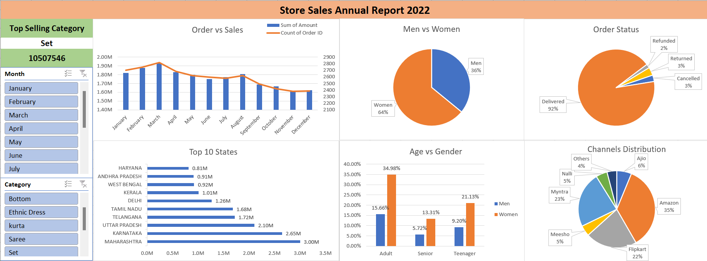

# Store Annual Sales Report - 2022

## Overview
The "Store Annual Sales Report - 2022" project aims to analyze and visualize key sales metrics for a retail store using Excel combined with AI-powered data analysis. The report provides a comprehensive view of the store's performance, focusing on customer demographics, order statuses, sales distribution across states, and top-selling categories.
## Resource & Technologies Used

**Dataset**

Option 1: [Kaggle](https://www.kaggle.com/datasets?fileType=csv)

Option 2: And, also the dataset can be found on [E-Learning Bridge](https://www.youtube.com/@shashank_mishra) YouTube Channel. I am grateful for his guidance on this project.

**Tools** 

Microsoft Excel + AI.

## Data Analysis & Visualization 

### 1. Order vs Sales 

**Insight:** A combined chart shows the correlation between the number of orders and total sales, highlighting trends over the year.

### 2. Gender Analysis

**Insight:** A pie chart reveals the distribution of sales between men and women, providing insight into customer demographics.

### 3. Order Status 

**Insight:** A pie chart details the proportion of orders that were canceled, delivered, refunded, and returned.

### 4. Top 10 States by Sales

**Insight:** A bar chart highlights the top-performing states, showcasing regions with the highest sales.

### 5. Age vs Gender 

**Insight:** A clustered column chart shows the relationship between age groups and gender, identifying key customer segments.

### 6. Channel Distribution 

**Insight:** A pie chart illustrates the sales distribution across various sales channels like Myntra, Meesho, etc.

### 7. Top-Selling Categories 

**Insight:** A pivot table identifies the best-selling product categories, helping focus on inventory and marketing efforts.

## Conclusion
The analysis provides valuable insights into the store's sales performance, revealing trends in customer behavior, regional sales distribution, and the effectiveness of various sales channels. The report highlights areas of strength, such as top-performing states and categories, as well as areas needing improvement, such as managing order cancellations and returns.
## Recommendation
To enhance sales performance in 2023, the store should focus on:

**Targeted Marketing:** Increase marketing efforts in top-performing states and among key demographic segments.

**Channel Optimization:** Invest in the most profitable sales channels and explore new ones with potential.

**Order Management:** Implement strategies to reduce cancellations and returns, such as better inventory management and customer service.
## Reflection
This project underscores the importance of data-driven decision-making in retail. By leveraging Excel and AI tools, the store can gain deeper insights into its operations and customer base. The process of analyzing and visualizing data has provided actionable recommendations that can lead to improved sales and customer satisfaction in the future.

